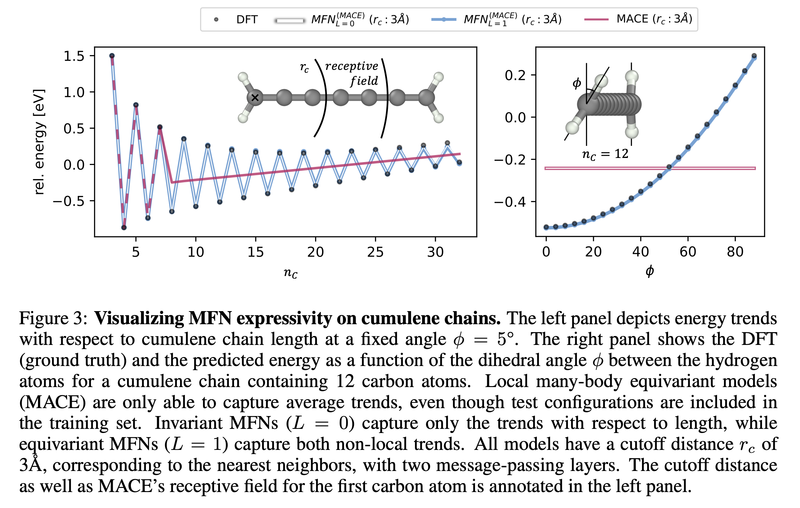

# Guarateed Non Local Cumulene Dataset


## Overview

This dataset is designed as a comprehensive challenge for machine learning force fields. It focuses on the task of regressing energy and forces from 3D molecular structures. The dataset consists of cumulenes, which due to their electronic structure, exhibit non-local effects. These pose a challenge for conventional machine learning force fields, including both attention-based and message-passing neural networks.

The dataset was published along with the [Matrix Function Network paper](https://arxiv.org/abs/2310.10434):

> **Equivariant Matrix Function Neural Networks**
> I Batatia, LL Schaaf, H Chen, G Csányi, C Ortner, FA Faber
International Conference on Learning Representations (ICLR) 2024

 which introduces a novel architecture designed to capture non-local effects. Please see the original manuscript for more details on the dataset and architecture. 

## Dataset description

Datasets designed to test non-local effects often yield unexpectedly high accuracy when evaluated with local models, complicating the assessment of model non-locality. The dataset introduced here is based on cumulenes, whose strong electronic delocalization results in a directly observable non-locality. 

Cumulenes are made up of a chain of double-bonded carbon atoms terminated with two hydrogen atoms at each end (see Figure). Cumulenes exhibit pronounced non-local behavior as a result of strong electron delocalization.  Small changes in chain length and relative angle between the terminating hydrogen atoms can result in large changes in the energy of the system, as visualised in Figure 3 below. 




The training set contains geometry-optimized cumulenes with 3-10 and 13, 14 carbon atoms, which are then rattled and rotated at various angles. The test set contains cumulenes created in a similar fashion with the same number of carbons (in-domain) and cumulenes of unseen length, not present in the dataset (out-domain 11,12 and 15,16). The `xyz` files contain descriptions of the different test sets. 

Please see the original [paper](https://arxiv.org/abs/2310.10434) for more details. 


## Usage
The data is stored in extended `xyz` file format as a simple text file, containting the positions, chemical elements, forces and energies. It is usefull to read these using the `Atomic Simulation Envionrment` package which is pip installable. 

## Citing

When using the dataset please cite the original paper. 
```
@inproceedings{batatia2023equivariant,
  title={Equivariant Matrix Function Neural Networks},
  author={Batatia, Ilyes and Schaaf, Lars L and Chen, Huajie and Cs{\'a}nyi, G{\'a}bor and Ortner, Christoph and Faber, Felix A},
  booktitle={International Conference on Learning Representations (ICLR) 2024},
  year={2023}
}
```